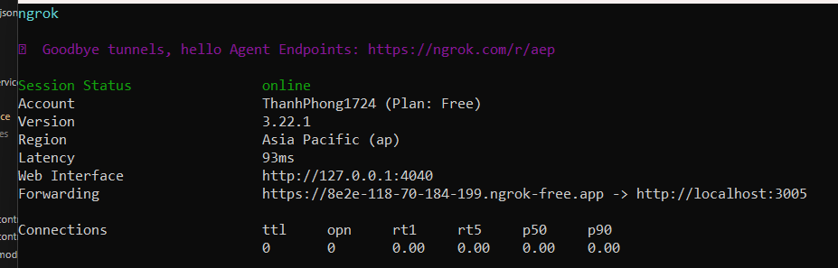

"# E-commerce Distributed System (Local Dev)" 

Lệnh chạy docker
docker-compose up --build --force-recreate

Lệnh xem địa chỉ mạng các service 
docker network inspect ecommerce-distributed-local_ecommerce_network

1. Authentication (Xác thực)

Register User (Đăng ký)
Method: POST
URL: http://localhost/api/users
Body (raw, JSON):
{
    "email": "testuser@example.com",
    "password": "password123",
    "firstName": "Test",
    "lastName": "User"
}

Auth: None
Login User (Đăng nhập)
Method: POST
URL: http://localhost/api/auth/login
Body (raw, JSON):
{
    "email": "testuser@example.com",
    "password": "password123"
}

Get User Profile (Lấy thông tin User)
Method: GET
URL: http://localhost/api/users/profile
Auth: Bearer Token (Dán token lấy từ Login vào đây)

2. Categories (Danh mục)
Create Category (Tạo Danh mục)
Method: POST
URL: http://localhost/api/categories
Auth: Bearer Token
Body (raw, JSON):
{
    "name": "Quần Jeans",
    "description": "Các loại quần jeans nam nữ"
}

(Lưu lại id của category vừa tạo từ response)
Get All Categories (Lấy tất cả Danh mục)
Method: GET
URL: http://localhost/api/categories
Auth: None
Get Category By ID (Lấy Danh mục theo ID)
Method: GET
URL: http://localhost/api/categories/YOUR_CATEGORY_ID (Thay YOUR_CATEGORY_ID)
Auth: None

3. Products (Sản phẩm)
Create Product (Tạo Sản phẩm)
Method: POST
URL: http://localhost/api/products
Auth: Bearer Token
Body (raw, JSON):
{
    "name": "Quần Jeans Slimfit Xanh",
    "description": "Quần jeans nam ống côn, màu xanh wash",
    "price": 450000,
    "stockQuantity": 100,
    "categoryId": "b8d1c381-24d9-460b-93ca-781bdcfac3e9" // <<< Thay ID category "Quần Jeans" đã tạo
}

(Lưu lại id của product vừa tạo từ response)
Get All Products (Lấy tất cả Sản phẩm)
Method: GET
URL: http://localhost/api/products
Auth: None

(Kiểm tra cache lần 1 và lần 2)
Get Product By ID (Lấy Sản phẩm theo ID)
Method: GET
URL: http://localhost/api/products/YOUR_PRODUCT_ID (Thay YOUR_PRODUCT_ID)
Auth: None
(Kiểm tra cache lần 1 và lần 2)

4. Cart (Giỏ hàng)
Add Item to Cart (Thêm vào Giỏ hàng)
Method: POST
URL: http://localhost/api/cart/items
Auth: Bearer Token
Body (raw, JSON):
{
    "productId": "YOUR_PRODUCT_ID", // <<< Thay ID sản phẩm đã tạo
    "quantity": 2
}

(Kiểm tra Redis key cart:{userId} sau khi gọi)
Get Cart (Lấy Giỏ hàng)
Method: GET
URL: http://localhost/api/cart (Hoặc /api/cart/:userId nếu bạn implement lấy userId từ param thay vì token)
Auth: Bearer Token

Remove Item from Cart (Xóa khỏi Giỏ hàng)
Method: DELETE
URL: http://localhost/api/cart/items/YOUR_PRODUCT_ID (Thay YOUR_PRODUCT_ID)
Auth: Bearer Token

5. Orders (Đơn hàng)
Create Order (Tạo Đơn hàng)
Method: POST
URL: http://localhost/api/orders
Auth: Bearer Token
Body (raw, JSON): {} (Hoặc thêm các field cần thiết như địa chỉ nếu service yêu cầu)
(Quan sát log order-service, log notification-service, RabbitMQ UI)
(Lưu lại id của order vừa tạo từ response)

Get User Orders (Lấy Lịch sử Đơn hàng)
Method: GET
URL: http://localhost/api/orders
Auth: Bearer Token
Get Order By ID (Lấy Đơn hàng theo ID)
Method: GET
URL: http://localhost/api/orders/YOUR_ORDER_ID (Thay YOUR_ORDER_ID)
Auth: Bearer Token

6. Payment (Thanh toán - Mô phỏng VNPay)
Create Payment URL (Tạo URL thanh toán)
Method: POST
URL: http://localhost/api/payment/create_payment_url
Auth: Bearer Token
Body (raw, JSON):
{
    "orderId": "YOUR_ORDER_ID",  // <<< Thay ID đơn hàng vừa tạo
    "amount": 900000, // <<< Số tiền đơn hàng (tính bằng VNĐ, ví dụ 2 quần jeans * 450k)
    "bankCode": "NCB", // Mã ngân hàng tùy chọn hoặc bỏ trống
    "orderDescription": "Thanh toan don hang YOUR_ORDER_ID",
    "language": "vn"
}

Response: Sẽ chứa một URL dài của VNPay. Bạn không cần click vào đây khi test backend.
Simulate VNPay IPN Call (Mô phỏng VNPay gọi về báo thành công)
Method: GET (Hoặc POST tùy bạn implement trong payment-service)
URL: http://localhost/api/payment/vnpay_ipn?vnp_ResponseCode=00&vnp_TxnRef=YOUR_ORDER_ID&vnp_Amount=90000000&vnp_OrderInfo=Thanh+toan+don+hang+YOUR_ORDER_ID&vnp_BankCode=NCB&vnp_TransactionNo=12345678&vnp_PayDate=20250504130000&vnp_SecureHash=PLACEHOLDER_HASH
Thay YOUR_ORDER_ID.
Lưu ý vnp_Amount là số tiền nhân 100 (900,000 VNĐ -> 90000000).
vnp_SecureHash cần được tính toán đúng dựa trên secret key và các tham số. Khi test thủ công, bạn có thể tạm bỏ qua việc check hash trong code payment-service hoặc dùng một hash tạm.
Auth: None
(Quan sát log payment-service xem có xử lý IPN và publish event không)
(Quan sát log order-service xem có nhận event và cập nhật trạng thái đơn hàng không)
(Quan sát RabbitMQ UI)

Check heath của service
wget -q --spider http://localhost:3005/health || exit 1

Ngân hàng: NCB
Số thẻ: 9704198526191432198
Tên chủ thẻ:NGUYEN VAN A
Ngày phát hành:07/15
Mật khẩu OTP:123456

Chạy 
ngrok http 3005
docker-compose up --build --force-recreate payment_service

na@gmail.com
admin@gmail.com
123456